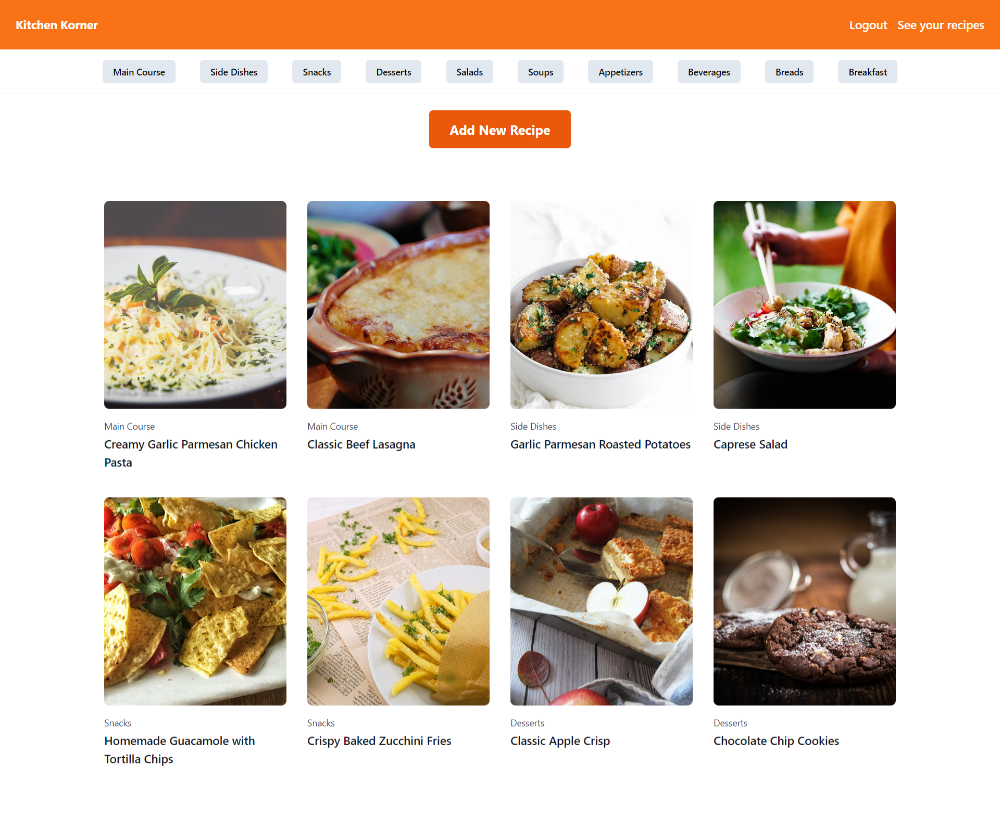
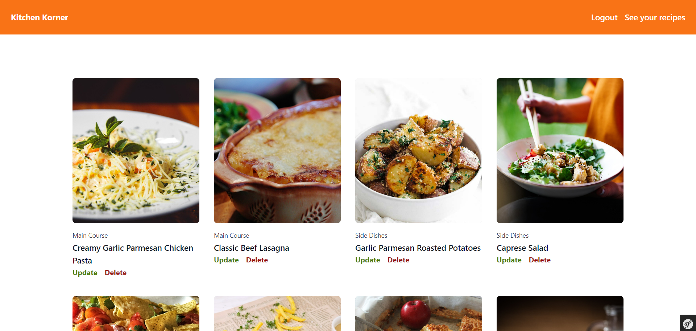
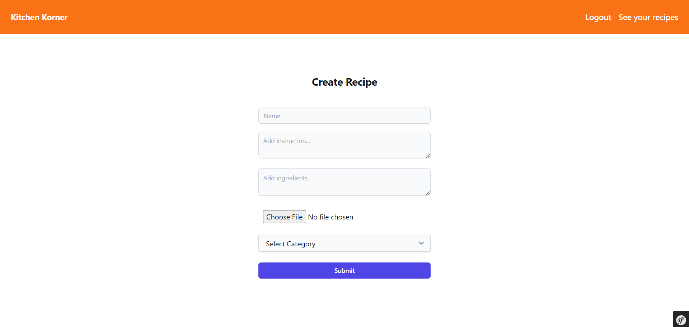
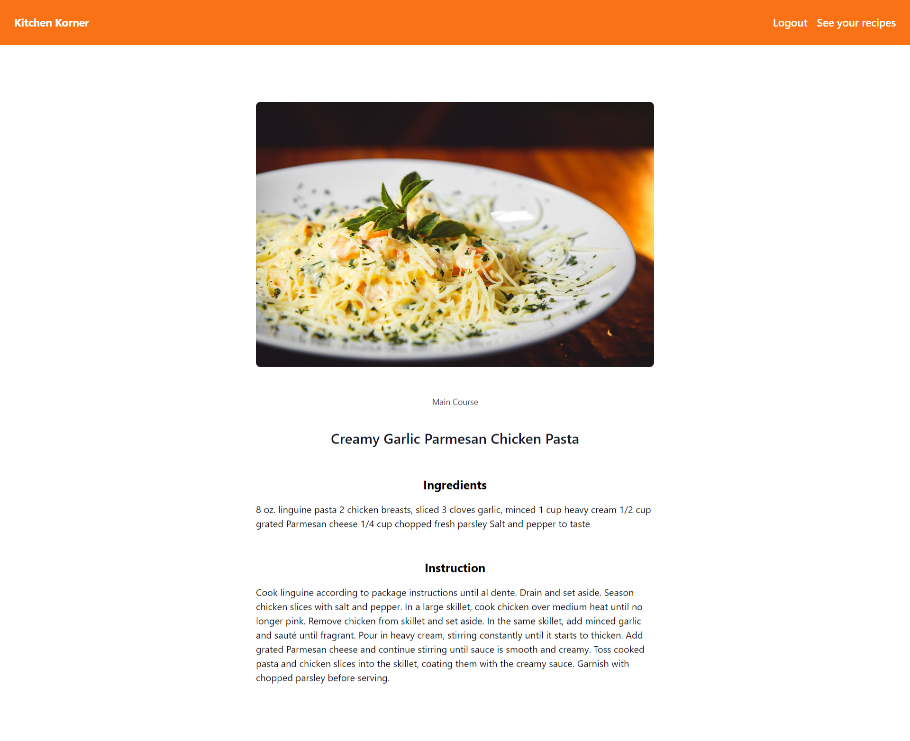

This project is a recipe application built with Symfony, where users can manage their recipes including creating, editing, and deleting recipes. Additionally, users can filter recipes by category.

## Project Features

- User Authentication: Users can register, log in, and log out securely to manage their recipes.

- Recipe Management: Users can create new recipes, edit existing ones, and delete recipes as needed.

- Category Filtering: Recipes can be filtered based on categories, making it easier for users to find specific types of recipes.

# Screenshots

## Getting Started

Follow these instructions to get the project up and running on your local machine:

1. Clone the repository to your local machine:
   git clone https://github.com/agness1/KitchenKorner.git
2. Navigate to the project directory
3. Install dependencies using Composer
   composer install
4. Configure your environment variables by copying the .env file
   cp .env.example .env
5. Generate the application key
   php bin/console generate:key
6. Set up your database and run migrations
7. Start the Symfony development server
   symfony serve
8. Access the application in your web browser at http://localhost:8000.
